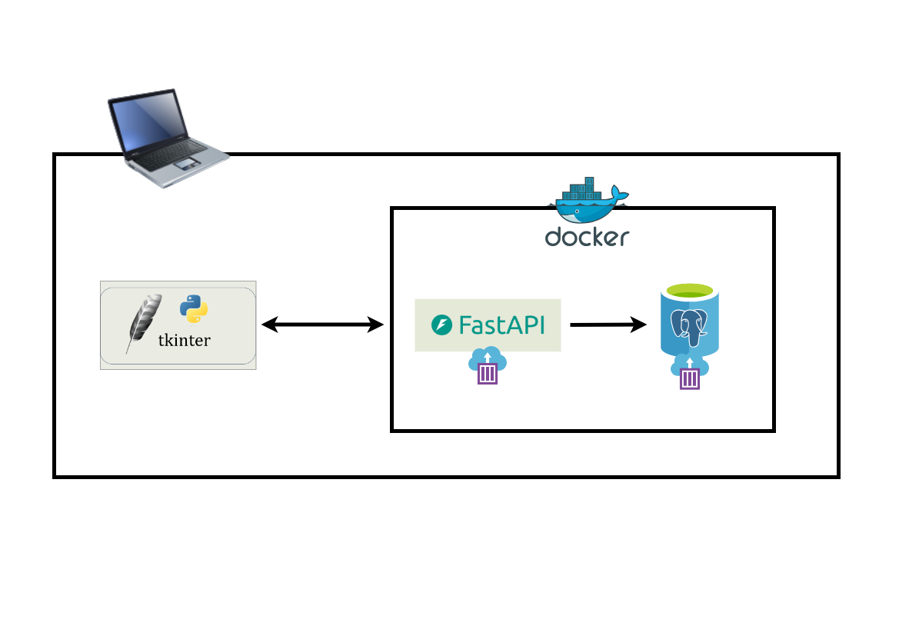

# Employee Management System
An Employee Management System developed using Python, Customtkinter and tkinter libraries. The system is designed to include functionalities:
- Adding a new employee
- Updating employee data
- Deleting a specified employee data
- Deleting all data

The database is a PostgreSQL database and stores all employee information(s) including first name, last name, phone number, address, role, gender, department and salary.

The UI contains a query interface that displays the results when the database is queried for employee data.

# Overview

# Flow Chart

## User Interface
>> TODO

## Setup
>> TODO
