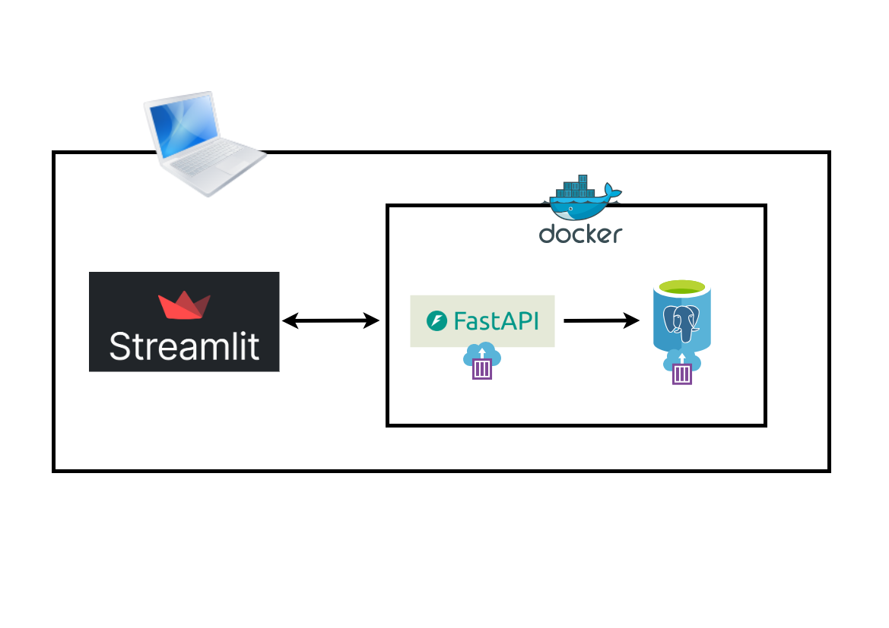

# Employee Management System
The Employee Management System (EMS) is a Python-based application with a Streamlit-powered web interface, designed to manage employee records efficiently. It provides a full suite of CRUD operations and integrates with a robust backend API built using FastAPI.

### System Architecture
- Streamlit provides a responsive web interface
- FastAPI exposes REST endpoints for CRUD operations
- PostgreSQL ensures data integrity and fast queries




### Features and Functionalities
The system includes the following features:
1. **User Authentication**
    - Secure login interface
    - Role-based access control (Admin, User)

2. **Employee Management**
    - *Add New Employee Data*: Captures comprehensive employee details including:
        - First, Middle and Last Name
        - Position and Department
        - Address
        - Phone Number
        - Salary
        - Gender
        - Date of Birth
        - Hired Date
    
    - *Update Employee Data*: Modify existing employee records, including:
        - Names (First, Middle and Last)
        - Address
        - Department
        - Position
        - Salary
        - Phone Number
    
    - *Delete Employee Data*
        - Strictly by Admin role
        - Option to delete individual employee record


3. **Employee Search**: Flexible query interface to search employees by:
    - First Name
    - Last Name
    - Employee ID
    - Department

4. **Backend Integration**:
    - All data operations are handled through a *FastAPI* backend
    - PostgreSQL database stores all employee information securely, including contact details, role, department, and salary.

 

### User Interface
>> TODO


### Getting Started (Windows)
1. Ensure Docker Desktop is installed and running
2. Clone the repository:
````
git clone https://github.com/Merci93/Employee-Management-System
cd Employee-Management-System
````

3. Run the setup batch script:
````
.\setup.bat
````

The batch script will:
    - Build the Docker image (if not already built)
    - Start Docker containers via docker-compose
    - Activate the virtual environment
    - Launch the EMS Streamlit UI


No manual virtual environment setup or Python commands are needed — everything is handled by setup.bat


### Tech Stack
 - *UI*: Streamlit
 - *Backend*: FastAPI
 - *Database*: PostgreSQL
 - *Containerization*: Docker & Docker Compose
 - *Language*: Python 3.10+
